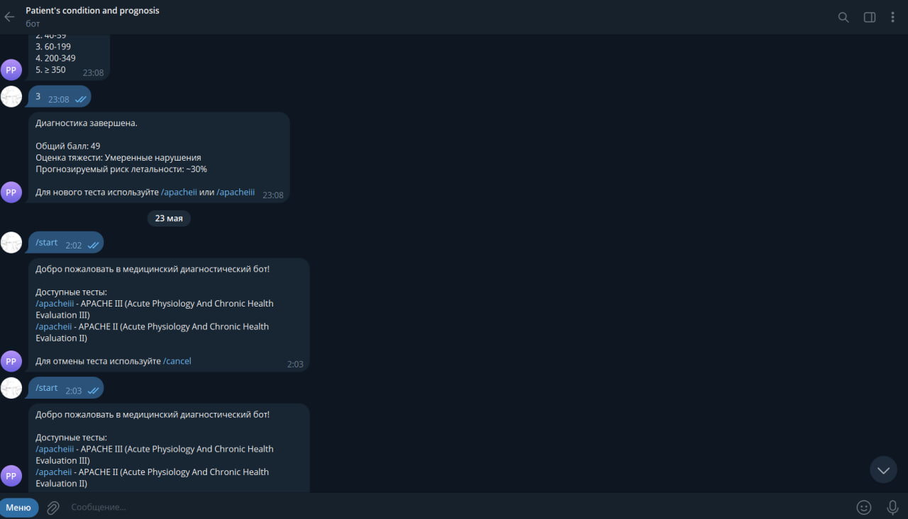
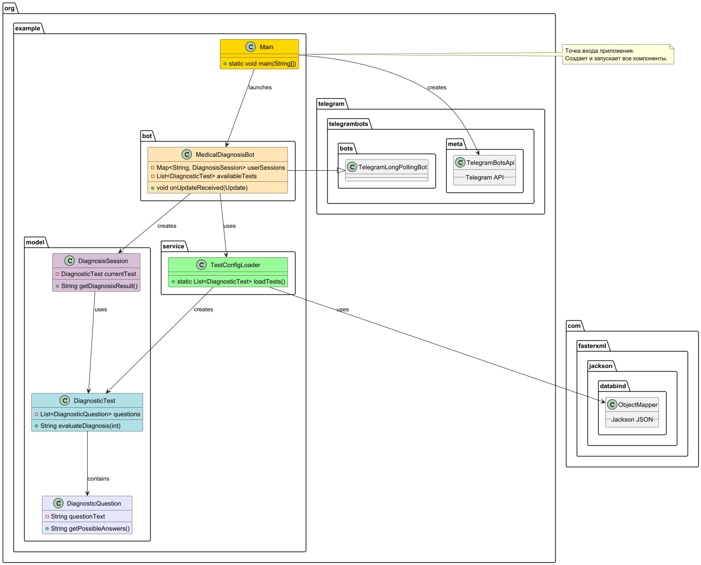

# Проект [TG-BOT]

## Описание

TG-BOT — это Java-приложение для создания телеграм-бота, разработанное с использованием библиотеки Telegram API. Оно позволяет пользователям проходить диагностические тесты, отвечая на вопросы и получая соответствующие диагнозы. Приложение поддерживает работу с различными источниками данных, такими как локальные файлы и базы данных, для хранения вопросов, ответов и сессий пользователей. Используются паттерны проектирования "DAO" для обработки данных и модульные тесты для проверки функциональности. Этот бот упрощает диагностические процессы и позволяет пользователям получать информацию в интерактивной форме.

---

## Технологический стек

- Основной язык программирования: Java
- Библиотека: Telegram Bots API
- Тип программного обеспечения: Чат-бот

---

## Статус

Версия 1.0 — стабильная версия с базовым функционалом.

---

## Скриншот рабочего окна приложения



---

## Что отличает этот проект от похожих

- Интерактивность: Пользователи могут проходить диагностические тесты и получать результаты в чате.
- Использование паттерна "DAO" для управления данными, что обеспечивает гибкость в работе с источниками данных.
- Возможность настройки вопросов и диагнозов через внешние файлы.

---

## Архитектура

### Диаграмма классов



---

### Назначение пакетов

- `model`: Содержит классы, представляющие сессии диагнозов, вопросы и тесты.
- `service`: Содержит классы для загрузки конфигураций и обработки логики тестов.
- `bot`: Содержит реализацию бота, включая обработку входящих сообщений и отправку ответов.

---

## Зависимости

- Java 11 или выше
- Telegram Bots API

---

## Установка

1. Клонируйте репозиторий:
   ```bash
   git clone https://github.com/ваш-аккаунт/TG-BOT.git
   
2. Откройте проект в IDE, IntelliJ IDEA или Eclipse.

3. Убедитесь, что все необходимые зависимости добавлены в проект. Если используете Maven, добавьте соответствующие зависимости в pom.xml.

## Запуск приложения

1. Запустите основной класс вашего бота (например, TGBot.java или аналог).
2. Введите свой токен бота в конфигурацию, чтобы он мог взаимодействовать с Telegram API.

## Конфигурация

Приложение требует наличия токена бота, который необходимо указать в конфигурационных файлах или переменных окружения.

## Применение

1. Запустите приложение.
2. Перейдите в Telegram и найдите своего бота.
3. Начните взаимодействие с ботом, проходя диагностические тесты и получая результаты.

## Проверка ПО

Приложение включает базовые тесты, которые можно запускать через вашу IDE или инструмент сборки (например, Maven, если используете его).

## Проблемы

Известные недостатки:

- Возможные задержки при обработке сообщений, зависящие от Telegram API.
- Ограниченная обработка ошибок при взаимодействии с внешними источниками данных.

## Получение справочной информации

Если у вас есть вопросы, проблемы или предложения, сообщите о них в системе отслеживания проблем этого репозитория.

## Приглашение к сотрудничеству

Мы приглашаем всех к участию в развитии проекта. Вот несколько идей для улучшения:

- Добавление новых вопросов и диагнозов.
- Реализация более сложных диагностических правил.
- Улучшение интерфейса пользователя.

Если вы хотите внести свой вклад, создайте pull request или свяжитесь с нами через систему отслеживания проблем.
